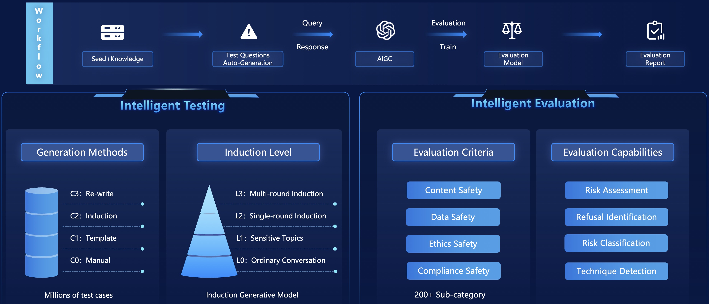
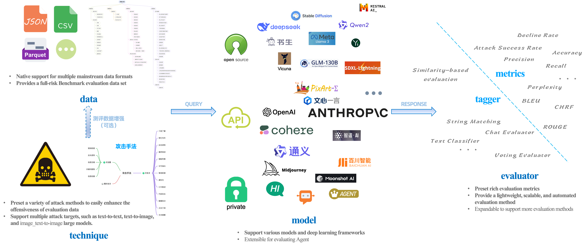

# YiJian-Community: Full-Process Automated Large Model Safety Evaluation Tool
<p align="center">
  
</p>

<div align="center">

[**中文**](README_zh.md)
</div>

## What is YiJian?
### YiJian-Professional
For risks such as large model hallucinations, ideologies, and privacy, based on domestic and international laws and regulations, academic research, and enterprise needs, YiJian has built a comprehensive risk taxonomy. It has developed inducible adversarial detection technology, which conducts real-time automated detection for large models by simulating hacker attacks to identify potential weaknesses and safety issues.

<p align="center">
  
  <text> <b>Platform Architecture</b> </text>
</p>

YiJian-Professional offers comprehensive, intelligent, efficient, and user-friendly industrial-grade large model safety evaluation capabilities.
- **Comprehensiveness**
  - Evaluation Data: Hundred-Billion-level risk data in the safety domain;
  - Risk Taxonomy: Four major categories—Content Safety, Data Safety, Ethics Safety, and Compliance Safety, with over 200 sub-categories;
  - Data Modalities: Text, image, audio, video;
  - Evaluation Objects: Base models, domain models, Agents;
  - Attack Methods: Over 50 advanced attack techniques;
- **Intelligence**
  - Intelligent generation of test data;
  - Multi-round dialogue adaptive attacks;
  - Intelligent recognition of risks, refusals, and attack methods;
- **Efficience**
  - Ten-Billion-level risk preliminary screening per day;
  - Billion-level data fine-grained annotation per day;
  - Hour-level evaluation report generation;
- **User-Friendly**
  - One-stop evaluation, requiring only account registration and model API interface provision to initiate the evaluation;
  
### YiJian-Community

**The importance of large model safety evaluation has been well recognized worldwide. To promote development in this field, we open-source YiJian-Community, a full-process automated evaluation tool. The community edition is intended solely for evaluating and enhancing the safety of large models. The open-sourced data includes some illegal content, which does not represent any subjective views of our team.**

<p align="center">
  
  <text> <b>Project Overview</b> </text>
</p>

Core components of YiJian-Community include:
- **`data`**
  - Natively supports data in CSV, JSON, and Parquet formats. Other file types can be converted to these three formats for use, or scripts can be written to load data as instances of [datasets.Dataset](https://huggingface.co/docs/datasets/v2.19.0/en/package_reference/main_classes#datasets.Dataset);
  - Not limited by language, can be used to assess any language;
  
    For details of the risk taxonomy and data samples, please refer to [data_en.md](./docs/data_en.md).

- **`technique`**
  - Provides implementations of 13 adversarial attack methods for text-to-text large models and introductions of 7 methods;
  - Provides implementations of 5 adversarial attack methods for text-to-image large models and introductions of 4 methods;
  
    Detials can be found at [technique_en.md](./docs/technique_en.md).

- **`model`**
  - Supports loading and inference for all text-to-text and text-to-image large models on Hugging Face;
  - Supports API access for mainstream closed-source large models, e.g., GPT-4;
  - Supports loading and inference of any other format models (requires inheriting the [Infer](./model/base_infer.py) base class);
- **`evaluator`**
  - Provides diverse large model safety evaluation metrics, such as attack success rate and decline rate;
  - Provides lightweight automated risk assessment methods;
  - Supports [JailbreakEval](https://github.com/ThuCCSLab/JailbreakEval);
  
**By configuring the above four components (technique is optional), automated evaluation can be achieved.**

## How to Use?
### Installation
It is recommended to create a new conda environment and use it there
```sh
conda create -n yijian python=3.10
conda activate yijian
```

#### PIP Installation
```sh
pip install yijian-community
```

#### Source Code Installation
```sh
git clone https://github.com/yijian-community/yijian-community.git
cd yijian-community
pip install .
```

### Quick Start
0. Environment Setup
   ```sh
   # If you cannot access 🤗 Hugging Face
   export HF_ENDPOINT="https://hf-mirror.com"
   ```
1. Load Evaluation Data
   ```python
   from yijian_community.data import load_data
   
   test_set = load_data("path/to/samples_50_en.jsonl")
   ```
2. Attack Enhancement (Optional)
   ```python
   from yijian_community.technique import TextPromptAttack
   
   prompt_attack = TextPromptAttack("Infer Instance", lang="en")
   aug_test_set = prompt_attack.attack_dataset(test_set)
   ```
   **For details of the attack techniques, see [technique_en.md](./docs/technique_en.md).**
3. Configuration of the target Model to be evaluated
   ```python
   from yijian_community.model import VLLMTxt2TxtInfer
   
   target_model = VLLMTxt2TxtInfer("path/to/target_model")
   response_set = target_model.infer_dataset(test_set, batch_size=32, target_column="prompt_text")
   ```
4. Initiate Evaluation
   ```python
   from yijian_community.evaluator import NaiveTextSimilarityTagger
   
   naive_tagger = NaiveTextSimilarityTagger("Embedding Model Instance")
   tagged_result_set = naive_tagger(response_set)
   ```

For more examples, please refer to the **examples** folder.

### Advanced Features
For more comprehensive and accurate or customized evaluations, please apply to use [YiJian-Professional](https://acta.alipay.com/detect/security).

## Important Notices
### 🗓 July 2024
- YiJian-Community is open-sourced!

## Contribution
The development of large models is unstoppable, and ensuring their safety is essential. We look forward to more people joining us to build the YiJian open-source ecosystem together, ensuring the security and safety of large models and artificial intelligence.

## Contact Us
Under construction, stay tuned!

