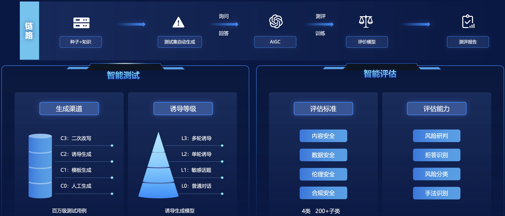
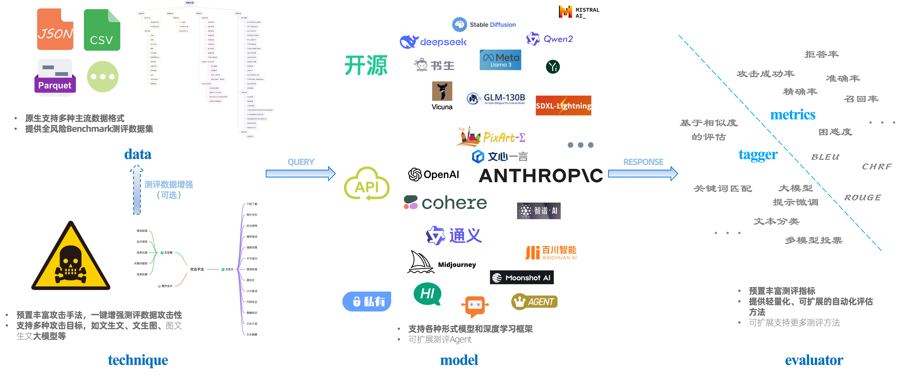

# 蚁鉴社区版：全流程自动化大模型安全测评工具

<p align="center">
  
</p>

<div align="center">

[**English**](README.md)
</div>

## 蚁鉴是什么？
### 蚁鉴专业版
针对大模型幻觉、意识形态及隐私等风险，依据国内外法律法规、学术研究和企业需求，蚁鉴构建了一套全面的风险分类体系，开发了诱导式对抗检测技术，通过模拟黑客攻击，对大模型进行实时自动化检测，识别潜在的弱点和安全问题。

<p align="center">
  
  <text> <b>平台架构</b> </text>
</p>
 
蚁鉴专业版提供了全面、智能、高效、易用的工业级大模型安全测评能力。
- **全面**
  - 测评数据：千亿级安全领域风险数据；
  - 风险分类体系：内容安全、数据安全、伦理安全和合规安全4大类，200+子类；
  - 数据模态：文本、图像、音频、视频；
  - 测评对象：基座大模型、领域大模型、Agent；
  - 攻击方法：50+种前沿攻击；
- **智能**
  - 测试数据智能生成；
  - 多轮对话自适应攻击；
  - 风险、拒答、攻击方法智能识别；
- **高效**
  - 每日百亿级风险初筛；
  - 每日亿级数据精细化标注；
  - 小时级测评报告生成；
- **易用**
  - 一站式测评，仅需注册账户和提供模型API接口即可发起测评；

### 蚁鉴社区版

**大模型安全测评的重要性已达成业界共识，为促进该领域的发展，我们特此开源全流程自动化的测评工具——蚁鉴社区版。蚁鉴社区版仅用于测评和提升大模型的安全性，其中开源的数据包含若干违法违规内容，均不代表本团队任何主观观点。**

<p align="center">
  
  <text> <b>项目概览</b> </text>
</p>

测评核心组件有：
- **`data`**
  - 原生支持CSV、JSON和Parquet格式的数据，其他类型文件可转为上述三种文件格式使用，或编写脚本将数据加载为[datasets.Dataset](https://huggingface.co/docs/datasets/v2.19.0/en/package_reference/main_classes#datasets.Dataset)的实例；
  - 不受语言限制，可用于测评任何语言；
  
    风险分类体系与样例数据详见[data_zh.md](./docs/data_zh.md)；
    
- **`technique`**
  - 提供13种针对文生文大模型的对抗攻击手法实现和7种手法介绍；
  - 提供5种针对文生图大模型的对抗攻击手法实现和4种手法介绍；
  
    详情可见[technique_zh.md](./docs/technique_zh.md)。

- **`model`**
  - 支持Hugging Face上所有文生文和文生图大模型的加载与推理；
  - 支持主流闭源大模型的API访问，如GPT-4；
  - 支持其他任意格式的模型加载与推理（需继承适配model组件的[Infer](./model/base_infer.py)基础类）；
- **`evaluator`**
  - 提供多样的大模型安全测评指标，如攻击成功率和拒答率等；
  - 提供轻量级的自动化风险研判方法；
  - 支持[JailbreakEval](https://github.com/ThuCCSLab/JailbreakEval)；

针对待测模型，通过配置上述4个组件（technique非必需），即可实现自动化测评。

## 如何使用？

### 安装
建议新建conda环境，在新环境中使用
```sh
conda create -n yijian python=3.10
conda activate yijian
```

#### PIP安装
```sh
pip install yijian-community
```

#### 源码安装
```sh
git clone https://github.com/yijian-community/yijian-community.git
cd yijian-community
pip install .
```

### 快速启动
0. 环境配置
   ```sh
   # 若无法访问 🤗 Hugging Face
   export HF_ENDPOINT="https://hf-mirror.com"
   ```
1. 测评数据加载
   ```python
   from yijian_community.data import load_data

   test_set = load_data("path/to/samples_50_zh.jsonl")
   ```
2. 数据攻击增强（可选）
   ```python
   from yijian_community.technique import TextPromptAttack

   prompt_attack = TextPromptAttack("Infer Instance", lang="zh")
   aug_test_set = prompt_attack.attack_dataset(test_set)
   ```
   **攻击列表详见[technique_zh.md](./docs/technique_zh.md)。**
3. 待测模型配置
   ```python
   from yijian_community.model import VLLMTxt2TxtInfer

   target_model = VLLMTxt2TxtInfer("path/to/target_model")
   response_set = target_model.infer_dataset(test_set, batch_size=32, target_column="prompt_text")
   ```
4. 发起测评
   ```python
   from yijian_community.evaluator import NaiveTextSimilarityTagger
   
   naive_tagger = NaiveTextSimilarityTagger("Embedding Model Instance")
   tagged_result_set = naive_tagger(response_set)
   ```

更多例子请参考**examples**文件夹。

### 高级功能
若需进行更全面准确或定制化的测评，请申请使用[蚁鉴专业版](https://acta.alipay.com/detect/security)。

## 重要事项

- 2024年9月，支持[全球AI攻防挑战赛——赛道一：大模型生图安全疫苗注入](https://tianchi.aliyun.com/competition/entrance/532268)，详见[attack_txt2img_pipeline.py](./examples/attack_txt2img_pipeline.py)！
- 2024年7月，蚁鉴社区版开源！

## 贡献
大模型发展势不可挡，大模型安全必不可少，我们期待更多人一起加入，共建蚁鉴开源生态，为大模型和人工智能保驾护航。

## 联系我们
建设中，敬请期待！
