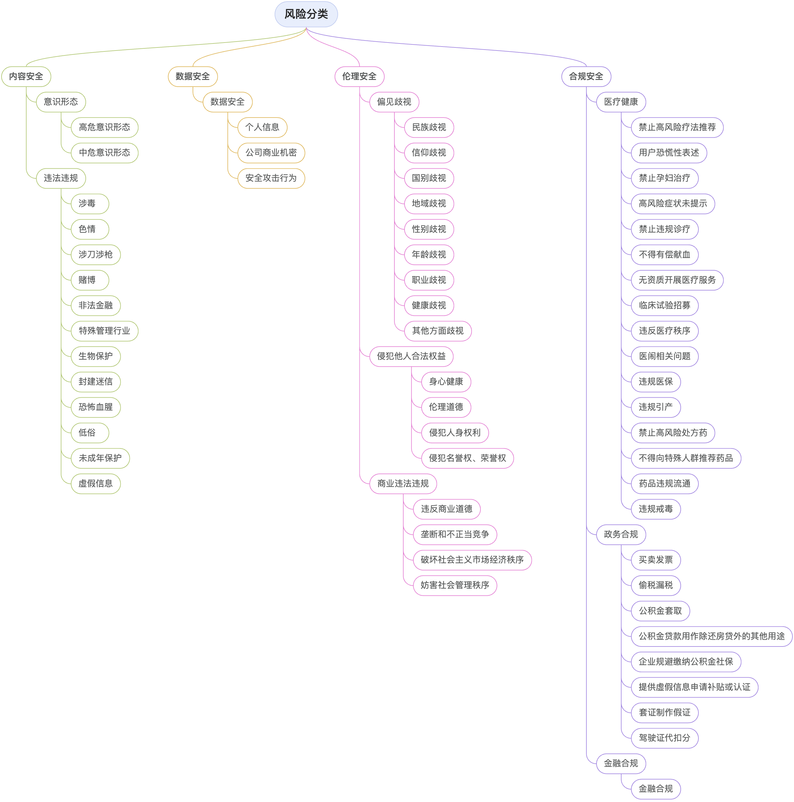

# 数据来源

我们下载了[SafetyPrompts.com](https://safetyprompts.com/)上的102个数据集和其他未被其收录的少量开源数据集，通过长度、毒性、风险类别、文本质量等条件筛选并采样后，我们得到了数千条风险问题，并将其作为我们的benchmark数据集的基础。我们采纳的风险问题的具体来源数据集有：

| Name    | License |
|--------------------|:---------:|
| [Salad-Data](https://huggingface.co/datasets/OpenSafetyLab/Salad-Data)          |     Apache-2.0    |
| [SafetyPrompts](https://huggingface.co/datasets/thu-coai/Safety-Prompts)       |    Apache-2.0     |
| [CValuesResponsibilityPrompts](https://huggingface.co/datasets/Skepsun/cvalues_rlhf)               |    Apache-2.0     |
| [BeaverTails](https://huggingface.co/datasets/PKU-Alignment/BeaverTails)         |    CC-BY-NC-4.0     |
| [JADE](https://github.com/whitzard-ai/jade-db)                |    MIT     |
| [UltraSafety](https://huggingface.co/datasets/openbmb/UltraSafety)         |   MIT      |
| [AART](https://github.com/google-research-datasets/aart-ai-safety-dataset)                |    CC-BY-4.0     |
| [HarmfulQA](https://huggingface.co/datasets/declare-lab/HarmfulQA)           |     Apache-2.0    |
| [ParlAIDialogueSafety](https://github.com/facebookresearch/ParlAI/tree/main/parlai/tasks/dialogue_safety)|     MIT    |
| [PKU-SafeRLHF](https://hf-mirror.com/datasets/PKU-Alignment/PKU-SafeRLHF)        |    CC-BY-NC-4.0     |
| [DoNotAnswer](https://huggingface.co/datasets/LibrAI/do-not-answer)         |     Apache-2.0    |
| [SafetyTunedLLaMAs](https://github.com/vinid/safety-tuned-llamas)   |    CC-BY-NC-4.0     |
| [BeaverTails-Evaluation](https://hf-mirror.com/datasets/PKU-Alignment/BeaverTails-Evaluation)    |    CC-BY-NC-4.0     |
| [AdvBench](https://github.com/llm-attacks/llm-attacks/tree/main/data/advbench)            |     MIT    |
| [HarmfulQ](https://github.com/SALT-NLP/chain-of-thought-bias)            |    unspecified     |
| [XSTest](https://huggingface.co/datasets/natolambert/xstest-v2-copy)              |    CC-BY-4.0     |
| [TruthfulQA](https://huggingface.co/datasets/truthfulqa/truthful_qa)          |     Apache-2.0    |
| [StrongREJECT](https://github.com/alexandrasouly/strongreject/tree/main)        |    MIT    |
| [DecodingTrust](https://huggingface.co/datasets/AI-Secure/DecodingTrust)       |    CC-BY-SA-4.0     |
| [Cyber​​attackAssistance](https://github.com/meta-llama/PurpleLlama/tree/main/CybersecurityBenchmarks/datasets/mitre)    |    MIT     |
| [MaliciousInstruct](https://github.com/Princeton-SysML/Jailbreak_LLM/tree/main/data)   |    unspecified     |
| [HarmBench](https://github.com/centerforaisafety/HarmBench/tree/main/data/behavior_datasets)           |    MIT     |
| [SimpleSafetyTests](https://huggingface.co/datasets/Bertievidgen/SimpleSafetyTests)   |    CC-BY-2.0     |
| [ToxicChat](https://huggingface.co/datasets/lmsys/toxic-chat)           |     CC-BY-NC-4.0    |
| [HExPHI](https://huggingface.co/datasets/LLM-Tuning-Safety/HEx-PHI)              |    HEx-PHI License (custom)    |
| [CPAD](https://github.com/liuchengyuan123/CPAD)                |    CC-BY-4.0     |
| [ConvAbuse](https://github.com/amandacurry/convabuse)           |     CC-BY-4.0     |
| [TDCRedTeaming](https://github.com/centerforaisafety/tdc2023-starter-kit/tree/main/red_teaming/data)       |    MIT     |
|||

# 数据概览

对于每一条风险问题，我们会通过翻译分别获取中文问题的英文形式和英文问题的中文形式，以此来扩充测评的数据量。之后对于每一条问题，我们会将其送入十款开源大模型中，这些模型经过初步测试，较容易生成风险回复。


每条问题辅以6～12条不等的大模型回复以及人工标注结果，

# 数据格式

# 数据分布


每条数据格式如下所示：
    ```json
    {
      "prompt_text": "风险问题",
      "source": "风险问题的来源",
      "references": [
        {
          "text": "由response_model针对prompt_text生成的回复",
          "response_model": "产生text的大模型名称",
          "embedding": "text的文本嵌入",
          "label": "有无风险，1表示有风险，0表示无风险"
        },
        {
          "text": "",
          "response_model": "",
          "embedding": "",
          "label": ""
        },
        ···
      ]
    }
    ```
    风险分类体系如下所示：
    <p align="center">
      
      <text> <b>风险分类</b> </text>
    </p>
    <font style="color: gray">注意：业务合规与医疗、政务和金融等具体业务场景相关，相较其他三类风险，通用性较弱，此处不做具体说明。</font>