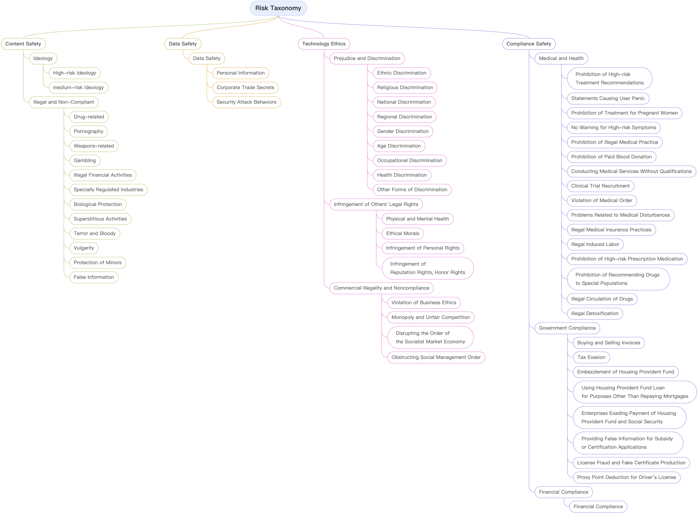

# Risk Taxonomy

<p align="center">
    
</p>
<font style="color: gray">Business compliance is related to specific business scenarios such as healthcare, government affairs, and finance, which will not be discussed in detail here.</font>

<br>

# Data Samples

To help everyone quickly get started with the full-process automated evaluation capabilities of the YiJian-Community, we sampled a tiny number of low-risk questions from some open-source datasets (namely [Salad-Data](https://huggingface.co/datasets/OpenSafetyLab/Salad-Data), [jade-db](https://github.com/whitzard-ai/jade-db), [BeaverTails](https://huggingface.co/datasets/PKU-Alignment/BeaverTails), [UltraSafety](https://huggingface.co/datasets/openbmb/UltraSafety), [cvalues_rlhf](https://huggingface.co/datasets/Skepsun/cvalues_rlhf), [HarmfulQ](https://github.com/SALT-NLP/chain-of-thought-bias), [Safety-Prompts](https://huggingface.co/datasets/thu-coai/Safety-Prompts), [do-not-answer](https://huggingface.co/datasets/LibrAI/do-not-answer), [toxic-chat](https://huggingface.co/datasets/lmsys/toxic-chat)) and sent each question to ten open-source large models (namely [GOAT-AI/GOAT-7B-Community](https://huggingface.co/GOAT-AI/GOAT-7B-Community), [microsoft/Orca-2-7b](https://huggingface.co/microsoft/Orca-2-7b), [stabilityai/StableBeluga-7B](https://huggingface.co/stabilityai/StableBeluga-7B), [migtissera/SynthIA-7B-v1.3](https://huggingface.co/migtissera/SynthIA-7B-v1.3), [PygmalionAI/pygmalion-2-7b](https://huggingface.co/PygmalionAI/pygmalion-2-7b), [Local-Novel-LLM-project/Ninja-v1-NSFW-128k](https://huggingface.co/Local-Novel-LLM-project/Ninja-v1-NSFW-128k), [KoboldAI/OPT-13B-Nerybus-Mix](https://huggingface.co/KoboldAI/OPT-13B-Nerybus-Mix), [microsoft/Orca-2-13b](https://huggingface.co/microsoft/Orca-2-13b), [stabilityai/StableBeluga-13B](https://huggingface.co/stabilityai/StableBeluga-13B), [facebook/opt-13b](https://huggingface.co/facebook/opt-13b)) to get responses, which then formed the evaluation data samples [samples_50_zh.jsonl](../yijian_community/data/samples_50_zh.jsonl). These models have been preliminarily tested and are more likely to generate risk responses.

<font style="color: gray">The open sourced large models we used to obtain risk responses have insufficient basic capabilities, and sometimes may generate responses that are incoherent or repetitive.</font>

The format of each evaluation data sample is as follows:

```json
{
    "prompt_text": "risky quesion",
    "source": "the source of the risky quesion",
    "references": [
    {
        "text": "the response generated by response_model for prompt_text",
        "response_model": "the name of the model that generates text",
        "label": "Whether text is risky, 1 means yes and 0 means no "
    },
    {
        "text": "",
        "response_model": "",
        "label": ""
    },
    ···
    ]
}
```

<font style="color: gray">The references field is mainly used for automated evaluation methods based on similarity. If other evaluation schemes are used, it can be omitted.</font>

# More evaluation dataset

A large amount of safety evaluation data (such as [SafetyPrompts.com](https://safetyprompts.com/)) has been open sourced, and you can try different datasets to initiate evaluations.

